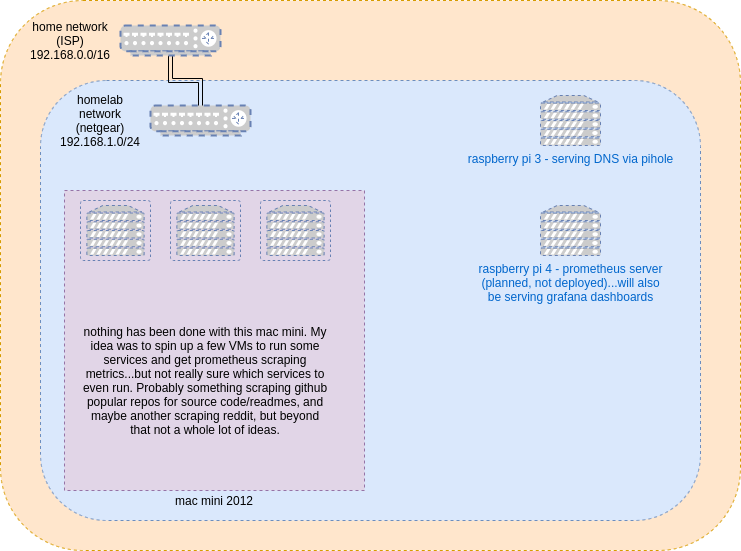

# Homelab

I decided to actually start working on my knowledge of prometheus/grafana/etc, I would start up a homelab. Actually getting my hands dirty with different VMs, networking issues, and monitoring/observability is the way I learn best, so I'm gonna just set up something in my own subnet sandbox and break it any way I please!



## Specs

- Raspberry Pi (CloudyPie)

Pi 3 Model B Plus Rev 1.3, running Pi OS Lite (headless)
ARMv7 rev 4 (v7l) 4 Core 1.2 GHz
1 GB RAM

Running the pihole, and probably not much else.

- Raspberry Pi (Cloud Monet)

Pi 4 Model B, running Pi OS Lite (headless)
TBD
4GB RAM

Running the prometheus server, collecting metrics from the rest of the lab and displaying via grafana.

- Mac Mini (Mac McCloud)

2012 Mac Mini with 16GB RAM, i7 quad-core

Running _some_ sort of services, probably scraping stuff and putting into S3...

## Setup Steps (Pi)

1. Get an SSD card (or whatever you're going to run the OS off of) and write the distribution you want. I'm currently using `2021-05-07-raspios-buster-armhf-lite`, but anything small should be fine.

2. After writing the OS, put a file called `ssh` (it can be empty, as long as the file exists) into the `/boot` directory of the SSD card. This will enable SSH on the first boot, without needing to SSH in manually and run `raspi-config` to enable it.
https://forums.raspberrypi.com/viewtopic.php?t=129727

3. After giving the Pi a few minutes to boot up, you can probably figure out what their IP addresses are by running something like `nmap -sP 192.168.0.0/24` (or whatever your local network is, and then try `nc -vz $HOST_IP 22` to check if the SSH server is listening and ready for connections. Put the host IPs into `ansbile/hosts`.

4. Run `create_keys.sh homelab` to create some SSH keys called `ansible/homelab` and `ansible/homelab.pub`.

5. Run `setup_base_config.sh` to setup basic SSH access with the keys generated to the Pi's, and disable password authentication. If you run the playbook twice, you'll still be able to connect with a password for a minute or so, and I suspect this is because the SSH server needs to reset. Eventually, running that script should fail with an `unreachable` message, which is what we want!

## Connecting to the different instances

```
ssh -i ansbile/homelab user@IP_HERE
```

## Goals

(for all the below, the eventual idea is to have them creatable from source control via automation)

- Learn to set up and configure a prometheus instance
- Learn to set up grafana dashboards customized to my heart's content
- Learn to orchestrate some VMs in a repeatable and declarative fashion
- Learn to deploy services to these VMs and instrument them
- Learn what reasonable SLI's are for these services (I'm the only user, so I'll probably just have to make these up).
- Learn and experiment with different ways to set up a virtualized/containerized environment (qemu/podman/etc)

...and as long as I'm creating services that _do_ things, I'll probably put them to work gathering data for a code corpus or a "how to write like a dev" course, or something equally silly like that.
